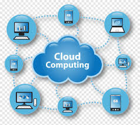
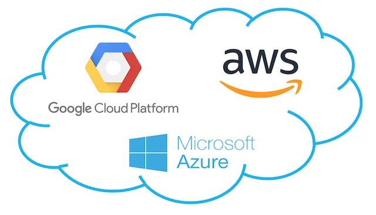
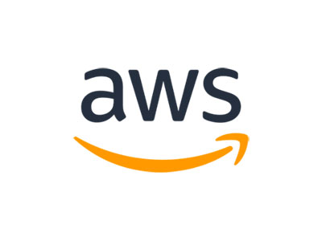
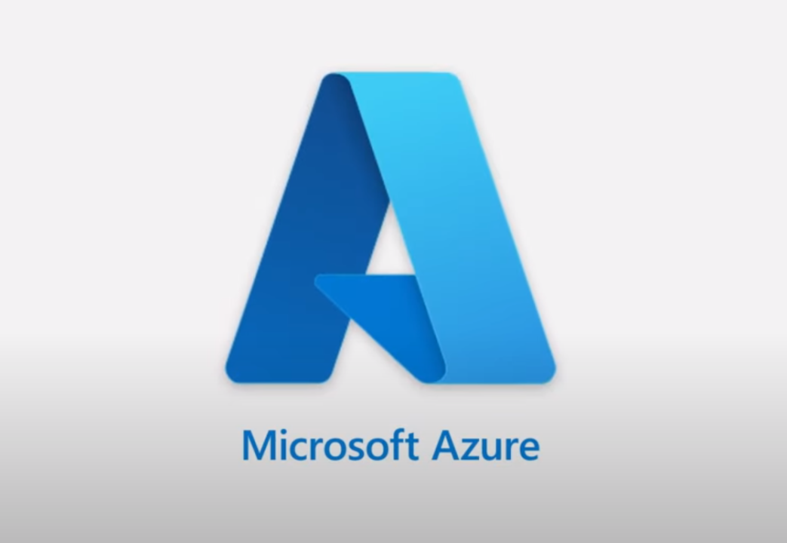

# Introdução a Computação em Nuvem
 “Repositório para apresentação sobre Computação em Nuvem para alunos - Trabalho de extensão”.
# Introdução à Computação em Nuvem

## O que é Computação em Nuvem?

Computação em nuvem é a entrega de serviços de computação através da Internet (nuvem), permitindo acesso a recursos como servidores, armazenamento e software sem a necessidade de infraestrutura física local.

## Tipos de Computação em Nuvem

### 1. Nuvem Pública

- **Descrição:** Recursos compartilhados entre vários clientes.
- **Exemplos:** AWS, Microsoft Azure, Google Cloud Platform.

### 2. Nuvem Privada

- **Descrição:** Recursos dedicados a uma única organização.
- **Implantação:** Pode ser gerida internamente ou por um provedor externo.

### 3. Nuvem Híbrida

- **Descrição:** Combina nuvens públicas e privadas, permitindo compartilhamento de dados e aplicativos.
- **Benefícios:** Flexibilidade e maior controle.

## Principais Provedores de Nuvem

### 1. Amazon Web Services (AWS)

- **Descrição:** Amplamente utilizado, oferece uma vasta gama de serviços.
- **Serviços:** Computação, armazenamento, bancos de dados, aprendizado de máquina.

### 2. Microsoft Azure

- **Descrição:** Integra-se bem com produtos Microsoft.
- **Serviços:** IaaS, PaaS, SaaS, análises e mais.

### 3. Google Cloud Platform (GCP)

- **Descrição:** Focado em Big Data e aprendizado de máquina.
- **Serviços:** Computação, armazenamento, análise de dados.

## Vantagens da Computação em Nuvem

- **Escalabilidade:** Ajuste de recursos conforme a demanda.
- **Custo-efetividade:** Pague apenas pelo que usar.
- **Flexibilidade:** Acesso de qualquer lugar com conexão à Internet.
- **Segurança:** Muitos provedores oferecem segurança avançada.

## Conclusão

A computação em nuvem está transformando a forma como utilizamos TI, oferecendo escalabilidade, flexibilidade e eficiência. Escolher o modelo e o provedor corretos pode trazer grandes benefícios.

---

**Referências:**

- [AWS](https://aws.amazon.com)
- [Microsoft Azure](https://azure.microsoft.com)
- [Google Cloud Platform](https://cloud.google.com)
- [Introdução à Computação em Nuvem - IBM](https://www.ibm.com/cloud/learn/cloud-computing)
